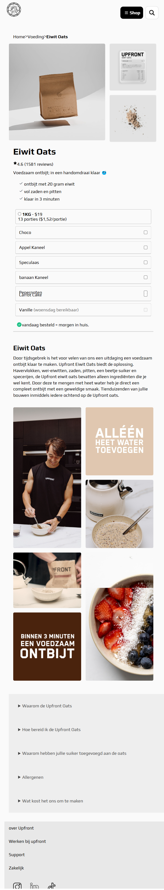
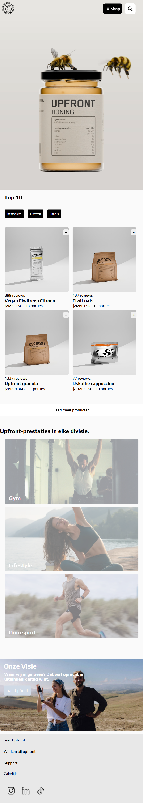
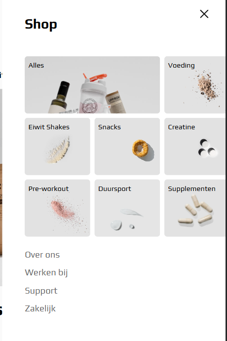
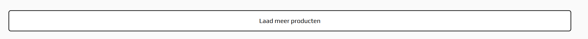

# Procesverslag
Markdown is een simpele manier om HTML te schrijven.  
Markdown cheat cheet: [Hulp bij het schrijven van Markdown](https://github.com/adam-p/markdown-here/wiki/Markdown-Cheatsheet).

Nb. De standaardstructuur en de spartaanse opmaak van de README.md zijn helemaal prima. Het gaat om de inhoud van je procesverslag. Besteedt de tijd voor pracht en praal aan je website.

Nb. Door *open* toe te voegen aan een *details* element kun je deze standaard open zetten. Fijn om dat steeds voor de relevante stuk(ken) te doen.

## Jij

  
uitwerken voor kick-off werkgroep

  ### Auteur:
  Benjamin Geersing

  #### Je startniveau:
  Blauw

  #### Je focus:
  resposive
 

## Je website

  
uitwerken voor kick-off werkgroep

  ### Je opdracht:
https://upfront.nl/
  #### Screenshot(s) van de eerste pagina (small screen): 
Homepage  

  #### Screenshot(s) van de tweede pagina (small screen):
Productlisting  
 

## Toegankelijkheidstest 1/2 (week 1)

  
uitwerken na test in 2e werkgroep

  ### Bevindingen
  Lijst met je bevindingen die in de test naar voren kwamen:

  - Amper tot geen hover/focus states
  - sommige buttons zijn niet goed leesbaar - bijvoorbeeld met tab heb je geen idee waar je bent zonder screen reader.
  - Geen opties op de site voor Toegankelijkheid, denk aan grotere buttons, geen autoplay op videos
  - hoog contrast wordt wel ondersteund, dit ziet er nog best cool uit. 
  - 

## Breakdownschets (week 1)

  
uitwerken na afloop 3e werkgroep

  ### de hele pagina: 
  

  ### dynamisch deel (bijv menu): 
  

  ### wellicht nog een dynamisch deel (bijv filter): 
  

 ### wellicht nog een dynamisch deel (bijv filter): 

## Voortgang 1 (week 2)

  
uitwerken voor 1e voortgang

  ### Stand van zaken
Ik ben nieuw in de HTML en CSS wereld. Dus ik was al trots op het feit dat ik mijn afbeeldingen allemaal op orde heb. 
Ook de structuur van mijn headers is goed. Hier zat ik eerst mee te klooien omdat ik niet zeker wist welke grootte ik nodig had.

  ### Agenda voor meeting
  samen met je groepje opstellen

3 studenten waren er niet. Ik was alleen met de student begeleider... Ik wilde vragen stellen over het volgende:

Mijn JS onclick werkte niet in de oefening
De structuur van mijn HTML is nog niet overzichtelijk
Vragen of ik inderdaad wel deze website wil (uiteindelijk geswitched naar upfront.nl)

  ### Verslag van meeting
  hier na afloop snel de uitkomsten van de meeting vastleggen

  - Ik ben van website gewisseld. Dit is niet opgenomen in dit document omdat ik alle screenshots en linkjes in de readme. al heb aangepast. 
  Hier heb ik meer opties rondom css. Wat ik graag meer wil oppikken. Ook ga ik dus voor responsive omdat deze site dat heel mooi doet. 
  - De structuur van mijn HTML was niet overzichtelijk. Ik had alles op dezelfde lijn. Ik moet meer met sections and lijstjes gaan werken.
  - Die Javascript moet nog een ander variabel hebben. Hier kon ik zelf niet uitkomen. Denk aan hoofdletters, en lees het hard op terug.
  - 

## Voortgang 2 (week 3)

  
uitwerken voor 2e voortgang

  ### Stand van zaken
  hier dit ging goed & dit was lastig (neem ook screenshots op van delen van je website en code)

- Ik snap niet hoe media queries werken, aangezien mijn website responsive is moet ik dit wel gaan begrijpen. 
Ben deze week vooral bezig geweest met grid en flex. Super intressant en ik kan dit gelijk toepassen in mijn bestand. 
Ik merk al wel dat mijn document aardig onoverzichtelijk is. Hier kan ik nog wel wat tips voor gebruiken. 

  ### Agenda voor meeting
  samen met je groepje opstellen
- Media queries -> ik moet 2 blocks die bij groot scherm naast elkaar staan bij klein scherm naast elkaar krijgen. Mag ik hier een div gebruiken?
- quality of life, mijn logo kreeg ik niet op de juiste plek.
- Algemene voortgang checken, hoe ver ben ik?
- 

  ### Verslag van meeting
  hier na afloop snel de uitkomsten van de meeting vastleggen

 Meer uitleg over resposive op de homepagina gekregen. Geleerd hoe je bepaalde blocks naast elkaar kan zetten door een wrapper div te gebruiken. Het begint echt ergens op te lijken!

## Toegankelijkheidstest 2/2 (week 4)

  
uitwerken na test in 9e werkgroep

  ### Bevindingen
  Lijst met je bevindingen die in de test naar voren kwamen (geef ook aan wat er verbeterd is):

-Ik ben erachter gekomen dat mijn nav ook wordt meegenomen in de links en headers. Terwijl deze eigenlijk hidden zou moeten zijn. 
Na navragen is dit te fixen met een "aria label". Hopelijk lukt dit nog op tijd. Aangezien ik ook een java script moet toevoegen om deze role er op en af te halen.
-Ik moet nog focus en hover states toevoegen, dit mist ook bij de website van upfront zelf. 
- Ik moet mijn alt teksten nog verder uitbreiden. 
- in nav kan je moeilijk het menu weer sluiten omdat de sluit knop boven aan het menu staat. Dit heb ik gefixt met behulp van een student begeleider!
- Ik kan niet navigeren naar de form met een reader. Ik kan ook niet weten wat voor label er aan hangt. 

## Voortgang 3 (week 4)

  
uitwerken voor 3e voortgang

  ### Stand van zaken
Ik heb deze week echt zitten stressen omdat ik zelf niet uit deze grid kwam. Hier ben ik samen met Ali uitgekomen. Soms moet ik wat sneller om hulp vragen... Verder ga ik nog bezig met hover states

  ### Agenda voor meeting
- Ik wil weten hoe ik bepaalde foto's sticky kan vormgeven zodat deze mee bewegen bij het scrollen
- Mijn respositories zijn niet goed meer en door de war. Daar moet ik hulp bij hebben
- Samen even kijken naar de beste manier om die FAQ toe te voegen (met )
- 

  ### Verslag van meeting
  hier na afloop snel de uitkomsten van de meeting vastleggen

Geleerd hoe ik met summarys en details kan werken voor fAQ, dit was heel erg makkelijk
Nieuwe respositories gemaakt en gefixt!
Sticky product foto' s ---> blijkbaar werkt overflow hidden niet met position sticky
Ook de "sluit menu" knop onderaan mijn html gezet zodat hij makkelijker te sluiten is bij de reader

## Eindgesprek (week 5)

  
uitwerken voor eindgesprek

  ### Je uitkomst - karakteristiek screenshots:
  
  
  
  

  ### Dit ging goed/Heb ik geleerd: 
  Korte omschrijving met plaatjes

hambuger menu - met een grid hierbinnen, werkende linkjes en hover states. Dit kon ik allemaal niet voordat ik aan dit vak begon :)
  
responsive website laat ik zien tijdens de mondeling, heel trots op de grid die meebewegen

  ### Dit was lastig/Is niet gelukt:
Op een of andere manier kreeg ik het niet voor elkaar te tab state aan te passen in de list items. Deze is nu saai zwart.
  

## Bronnenlijst

  
continu bijhouden terwijl je werkt

  Nb. Wees specifiek ('css-tricks' als bron is bijv. niet specifiek genoeg). 
  Nb. ChatGpT en andere AI horen er ook bij.
  Nb. Vermeld de bronnen ook in je code.

Ik heb eigenlijk amper bronnen gebruikt en elk lijntje code zelf geschreven. Wel heb ik bij het maken van de Grid op pagina 2 hulp gekregen van Ali. Ook heb ik verder wel tips ontvangen. 
  1. Hamburger menu afgekeken van opdrachten (codepen) 
  2. Inspiratie voor Javascript van opdrachten
  3. Afbeeldigen, video's en alle andere content van upfront.nl

