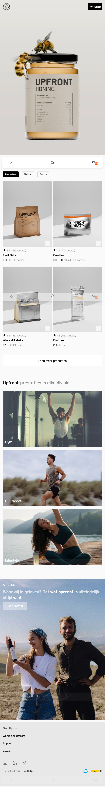
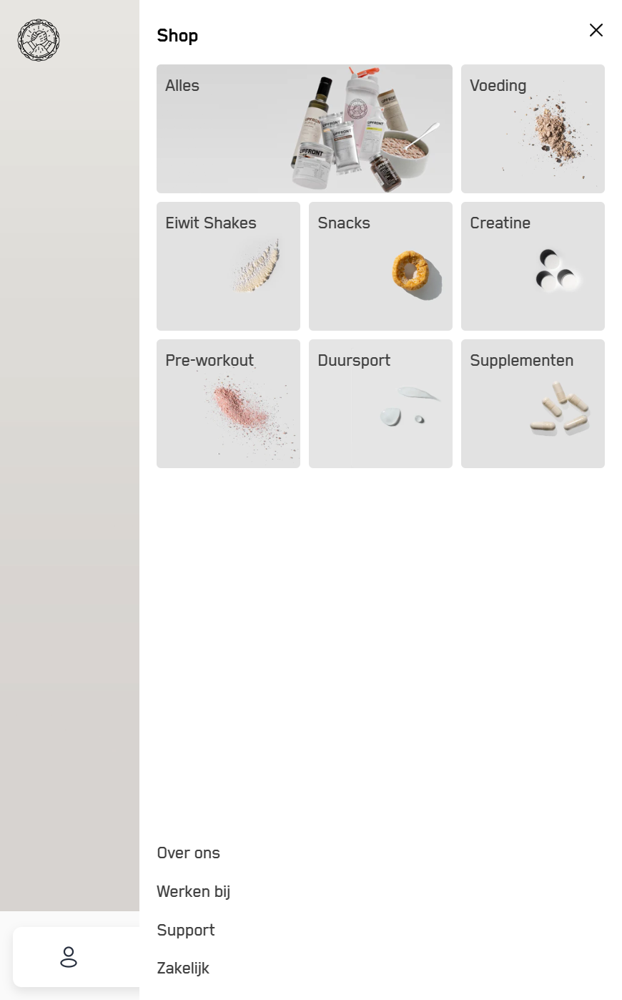

# Procesverslag
Markdown is een simpele manier om HTML te schrijven.  
Markdown cheat cheet: [Hulp bij het schrijven van Markdown](https://github.com/adam-p/markdown-here/wiki/Markdown-Cheatsheet).

Nb. De standaardstructuur en de spartaanse opmaak van de README.md zijn helemaal prima. Het gaat om de inhoud van je procesverslag. Besteedt de tijd voor pracht en praal aan je website.

Nb. Door *open* toe te voegen aan een *details* element kun je deze standaard open zetten. Fijn om dat steeds voor de relevante stuk(ken) te doen.

## Jij

  
uitwerken voor kick-off werkgroep

  ### Auteur:
  Benjamin Geersing

  #### Je startniveau:
  Blauw

  #### Je focus:
  Surface plane 
 

## Je website

  
uitwerken voor kick-off werkgroep

  ### Je opdracht:
https://upfront.nl/
  #### Screenshot(s) van de eerste pagina (small screen): 
Homepage  

  #### Screenshot(s) van de tweede pagina (small screen):
Productlisting  
 

## Toegankelijkheidstest 1/2 (week 1)

  
uitwerken na test in 2e werkgroep

  ### Bevindingen
  Lijst met je bevindingen die in de test naar voren kwamen:

## Breakdownschets (week 1)

  
uitwerken na afloop 3e werkgroep

  ### de hele pagina: 
  

  ### dynamisch deel (bijv menu): 
  

  ### wellicht nog een dynamisch deel (bijv filter): 
  

 ### wellicht nog een dynamisch deel (bijv filter): 

## Voortgang 1 (week 2)

  
uitwerken voor 1e voortgang

  ### Stand van zaken
Ik ben nieuw in de HTML en CSS wereld. Dus ik was al trots op het feit dat ik mijn afbeeldingen allemaal op orde heb. Ook de structuur van mijn headers is goed. Hier zat ik eerst mee te klooien omdat ik niet zeker wist welke grootte ik nodig had.

  ### Agenda voor meeting
  samen met je groepje opstellen

3 studenten waren er niet. Ik was alleen met de student begeleider... Ik wilde vragen stellen over het volgende:

Mijn JS onclick werkte niet in de oefening
De structuur van mijn HTML is nog niet overzichtelijk
Vragen of ik inderdaad wel deze website wil

  ### Verslag van meeting
  hier na afloop snel de uitkomsten van de meeting vastleggen

  - Ik ben van website gewisseld. Dit is niet opgenomen in dit document omdat ik alle screenshots en linkjes in de readme. al heb aangepast. Hier heb ik meer opties rondom css. Wat ik graag meer wil oppikken. 
  - De structuur van mijn HTML was niet overzichtelijk. Ik had alles op dezelfde lijn. Ik moet meer met sections and lijstjes gaan werken.
  - Die Javascript moet nog een ander variabel hebben. Hier kon ik zelf niet uitkomen.
  - ...

## Voortgang 2 (week 3)

  
uitwerken voor 2e voortgang

  ### Stand van zaken
  hier dit ging goed & dit was lastig (neem ook screenshots op van delen van je website en code)

  ### Agenda voor meeting
  samen met je groepje opstellen

  | student 1      | student 2          | student 3    | student 4        |
  | ---            | ---                | ---          | ---              |
  | dit bespreken  | en dit             | en ik dit    | en dan ik dat    |
  | en dat ook nog | dit als er tijd is | nog een punt | dit wil ik zeker |
  | ...            | ...                | ...          | ...              |

  ### Verslag van meeting
  hier na afloop snel de uitkomsten van de meeting vastleggen

  - punt 1
  - punt 2
  - nog een punt
- ...

## Toegankelijkheidstest 2/2 (week 4)

  
uitwerken na test in 9e werkgroep

  ### Bevindingen
  Lijst met je bevindingen die in de test naar voren kwamen (geef ook aan wat er verbeterd is):

-Ik ben erachter gekomen dat mijn nav ook wordt meegenomen in de links en headers. Terwijl deze eigenlijk hidden zou moeten zijn. Na navragen is dit te fixen met een "aria label". Hopelijk lukt dit nog op tijd. Aangezien ik ook een java script moet toevoegen om deze role er op en af te halen.
-

## Voortgang 3 (week 4)

  
uitwerken voor 3e voortgang

  ### Stand van zaken
  hier dit ging goed & dit was lastig (neem ook screenshots op van delen van je website en code)

  ### Agenda voor meeting
- Ik wil weten hoe ik bepaalde foto's sticky kan vormgeven zodat deze mee bewegen bij het scrollen
- Mijn respositories zijn niet goed meer en door de war. Daar moet ik hulp bij hebben
- Samen even kijken naar de beste manier om die FAQ toe te voegen (met )
- 

  ### Verslag van meeting
  hier na afloop snel de uitkomsten van de meeting vastleggen

  - punt 1
  - punt 2
  - nog een punt
  - ...

## Eindgesprek (week 5)

  
uitwerken voor eindgesprek

  ### Je uitkomst - karakteristiek screenshots:
  

  ### Dit ging goed/Heb ik geleerd: 
  Korte omschrijving met plaatjes

  

  ### Dit was lastig/Is niet gelukt:
  Korte omschrijving met plaatjes

  

## Bronnenlijst

  
continu bijhouden terwijl je werkt

  Nb. Wees specifiek ('css-tricks' als bron is bijv. niet specifiek genoeg). 
  Nb. ChatGpT en andere AI horen er ook bij.
  Nb. Vermeld de bronnen ook in je code.

  1. bron 1
  2. bron 2
  3. ...

